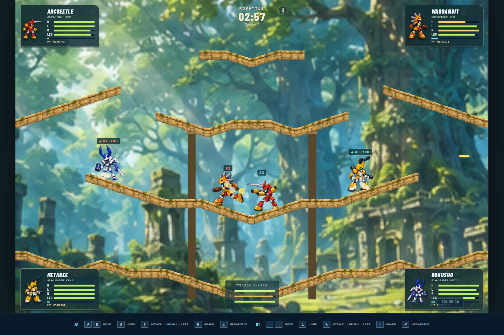

# Robattle Arena

Pick a robot. Bring a friend. Break their armor.

An unofficial browser-game fan prototype inspired by **Medabots AX for Game Boy Advance**. Fight real-time 1-vs-1, 2-vs-2, or 3-vs-3 platform battles with crisp cel-style robots and layered HD-2D scenery, destructible parts, and keyboard or gamepad controls. Play alone with AI partners, share one computer with up to six combatants, or join friends online through a Colyseus server.



## Try it

You need [Node.js](https://nodejs.org/en/download) and pnpm 10. Use a current Node.js LTS release; the project requires Node 22.12+; Node 24 LTS is recommended. No ROM, emulator, account, or gamepad is required.

1. Download or clone this repository and open a terminal in its folder.
2. Install pnpm if you do not already have it: `npm install --global pnpm@10`.
3. Run:

   ```sh
   pnpm install
   pnpm dev
   ```

Open **http://localhost:5173** (or the address printed in your terminal). Choose **Single player / Local**, select a match size, pick your robots and battlefield, and press **Start Robattle**. Stop the development server with Ctrl+C.

## Play

Destroy the enemy leader’s head to win; knocking out a partner does not end the round. Guard to protect your parts, vary your jump height, and watch each weapon’s readiness. Head weapons have limited uses. Medaforce builds automatically, faster when you stand still.

| Default keyboard | Action                       |
| ---------------- | ---------------------------- |
| ← / →            | Move; double-tap to dash     |
| G                | Jump; hold for a higher jump |
| F                | Right-arm attack             |
| ↑ + F / ↓ + F    | Head / left-arm attack       |
| ↓ + G            | Drop through a platform      |
| D                | Hold to guard                |
| S / A            | Partner panel / Medaforce    |
| Escape or Enter  | Pause                        |

Each robot card lets you choose a player controller or AI with **Easy**, **Normal**, or **Hard** difficulty. The battlefield thumbnail previews its scenery and platforms. Open **Controls → Players** and choose **2 on one keyboard** for two players. The same panel offers three-player and gamepad presets. **How to play** shows large key icons and attack combinations; select a key to change it. Connect a controller and press one of its buttons to make it appear. Unassigned slots use AI. These local controls share one computer. Choose **Online multiplayer** in the entry menu for network battles.

**Choose from all 30 AX Medabots and 19 battlefields**, with 120 source-derived parts, 12 medals, support weapons, traps, status effects and Medaforce attacks. This remaster remains in progress: AI navigation and some weapon/special details still approximate the original. See the [fidelity status](docs/ax-remaster-status.md) for verified behavior and remaining work.

See the [controls guide](docs/controls.md) for all presets, controller mappings, and keyboard ghosting tips. This is a desktop prototype; touch controls are not included.

## Play online

```sh
pnpm dev:all      # Run the browser app and online server together
# Or run them separately:
pnpm dev         # Browser app
pnpm dev:server  # Colyseus server
```

Choose **Online multiplayer → Localhost**. Pick your name and character, create a 1v1, 2v2 or 3v3 battle, and wait for friends to join and ready up. Each online player controls one robot. Custom server addresses are saved in your browser; built-in addresses and online timing live in `config/online.json`.

See [Online multiplayer](docs/online-multiplayer.md) for LAN/public servers, configuration, architecture, disconnect behavior and deployment. The [research report](docs/research/online-multiplayer.md) explains the Colyseus capabilities and design choices. This first version uses server-authoritative play with interpolation; prediction and lag compensation are future work.

## Build or contribute

```sh
pnpm check       # Formatting, linting, types, tests, and production build
pnpm preview     # Play the built version locally
```

The browser build is in `dist/` and can be served by a static web host. `pnpm build:server` produces the separate online server; run it with `pnpm start:server`. `pnpm build:all` builds both. Local play needs no backend.

Want to tune damage, add a robot, or improve game feel? Start with [Contributing](CONTRIBUTING.md), [Editing content](docs/content.md), or [Architecture](docs/architecture.md). Gameplay and input presets live in readable JSONC files.

## License and attribution

Original code is available under the [MIT license](LICENSE). This fan project is not affiliated with or endorsed by the Medabots rights holders. Franchise names and character designs belong to their respective owners and are not licensed by this project. No ROMs, extracted sprites, game audio, or official models are bundled. See [NOTICE](NOTICE.md) for rights limitations and third-party credits.
